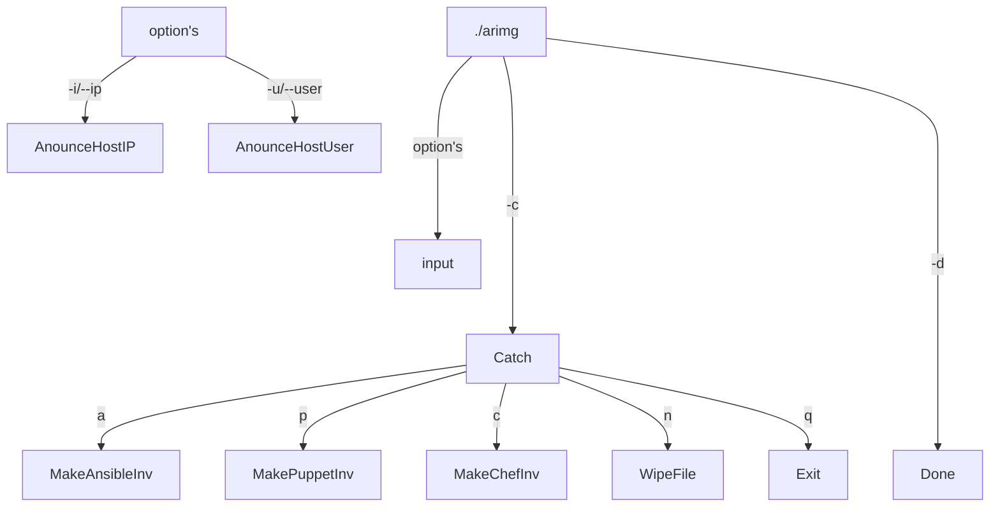

```mermaid
graph TD;
  ./arimg---->|-c|Catch;
  ./arimg----->|-d|Done;
 
  Catch-->|a|MakeAnsibleInv;
  Catch-->|p|MakePuppetInv;
  Catch-->|c|MakeChefInv;
  Catch-->|n|WipeFile;
  Catch-->|q|Exit;
  option's-->|-i/--ip|AnounceHostIP
  option's-->|-u/--user|AnounceHostUser
  ./arimg--->|option's|input
  
```
