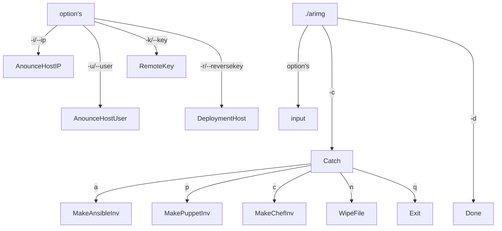
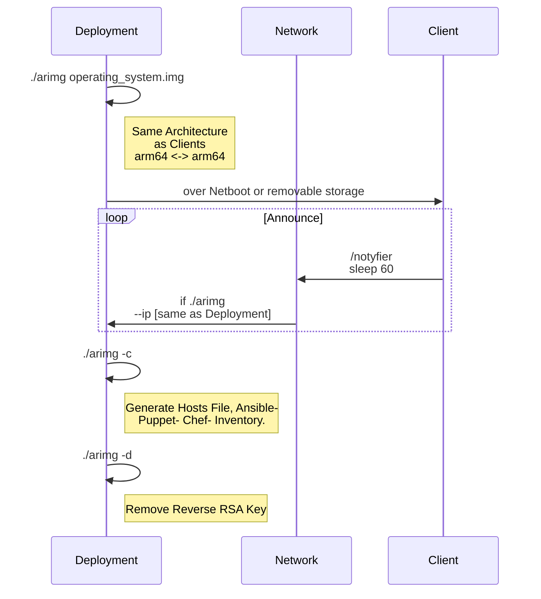

## arimg options

```mermaid
graph TD;
  ./arimg--->|option's|input
  ./arimg---->|-c|Catch;
  ./arimg----->|-d|Done;


  Catch-->|a|MakeAnsibleInv;
  Catch-->|p|MakePuppetInv;
  Catch-->|c|MakeChefInv;
  Catch-->|n|WipeFile;
  Catch-->|q|Exit;


  option's-->|-i/--ip|AnounceHostIP
  option's--->|-u/--user|AnounceHostUser
  option's-->|-k/--key|RemoteKey
  option's--->|-r/--reversekey|DeploymentHost
```

## Deployment chart

```mermaid
sequenceDiagram
    participant Deployment
    participant Network
    participant Client    

    Deployment->>Deployment: ./arimg operating_system.img

    Note right of Deployment: Same Architecture <br/>as Clients<br/> arm64 <-> arm64

    Deployment->>Client: over Netboot or removable storage
    loop Announce
        Client->>Network: /notyfier <br/>sleep 60
        Network->>Deployment: if ./arimg <br/>--ip [same as Deployment]
    end
    Deployment->>Deployment: ./arimg -c
    Note right of Deployment: Generate Hosts File, Ansible- <br/>Puppet- Chef- Inventory.

    Deployment->>Deployment: ./arimg -d
    Note right of Deployment: Remove Reverse RSA Key

```

## Depenency Relationship Diagram

```mermaid
erDiagram
    Bash ||--o{ ORDER : places
    Bash }|..|{ DELIVERY-ADDRESS : depend
      Bash }|..|{ cd : depen
      Bash }|..|{ dirname : depen
      Bash }|..|{ pwd : depen
      Bash }|..|{ echo : depen
      Bash }|..|{ grep : depen
      Bash }|..|{ cat : depen
      Bash }|..|{ mv : depen
      Bash }|..|{ clear : depen
      Bash }|..|{ awk : depen
      Bash }|..|{ sort : depen
      Bash }|..|{ uniq : depen
      Bash }|..|{ sed : depen
      Bash }|..|{ rm : depen
      Bash }|..|{ read : depen
      Bash }|..|{ rev : depen
      Bash }|..|{ cut : depen
      Bash }|..|{ touch : depen
      Bash }|..|{ ansible-inventory : depen
      Bash }|..|{ set : depen
      Bash }|..|{ getopt : depen
      Bash }|..|{ ip : depen
      Bash }|..|{ whoami : depen
      Bash }|..|{ break : depen
      Bash }|..|{ test : depen
      Bash }|..|{ file : depen
      Bash }|..|{ sudo : depen
      Bash }|..|{ umount : depen
      Bash }|..|{ ssh-keygen : depen
      Bash }|..|{ unzip : depen
      Bash }|..|{ cp : depen
      Bash }|..|{ xz : depen
      Bash }|..|{ fdisk : depen
      Bash }|..|{ mount : depen
      Bash }|..|{ mkdir : depen
      Bash }|..|{ dd : depen
      Bash }|..|{ parted : depen
      Bash }|..|{ losetup : depen
      Bash }|..|{ mkfsvfat : depen
      Bash }|..|{ mkfsext4 : depen
      Bash }|..|{ bsdtar : depen
      Bash }|..|{ chroot : depen
      chroot }|..|{ mv : img-depen
      chroot }|..|{ useradd : img-depen
      chroot }|..|{ mkdir : img-depen
      chroot }|..|{ echo : img-depen
      chroot }|..|{ chown : img-depen
      chroot }|..|{ chmod : img-depen
      chroot }|..|{ cat : img-depen
      chroot }|..|{ mv : img-depen
      chroot }|..|{ mkdir : img-depen
      chroot }|..|{ systemctl : img-depen


```
