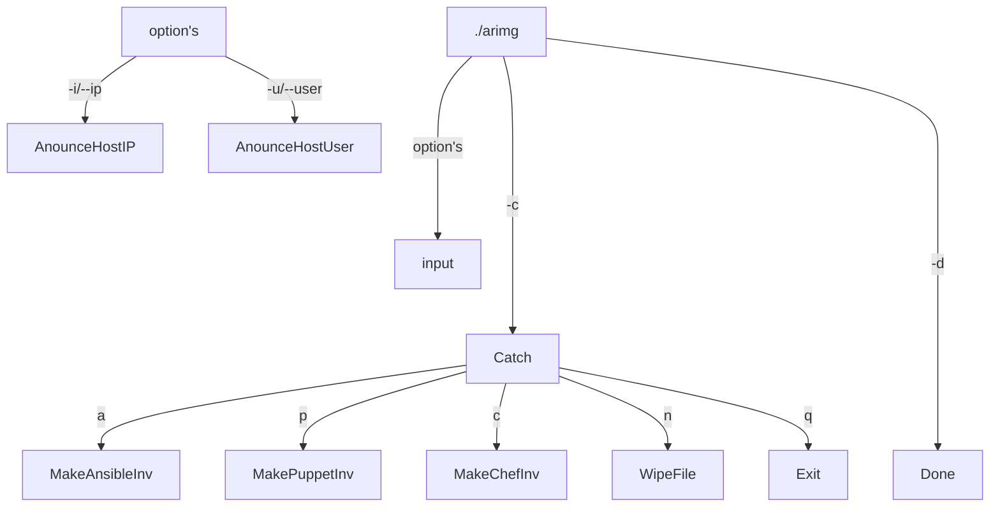
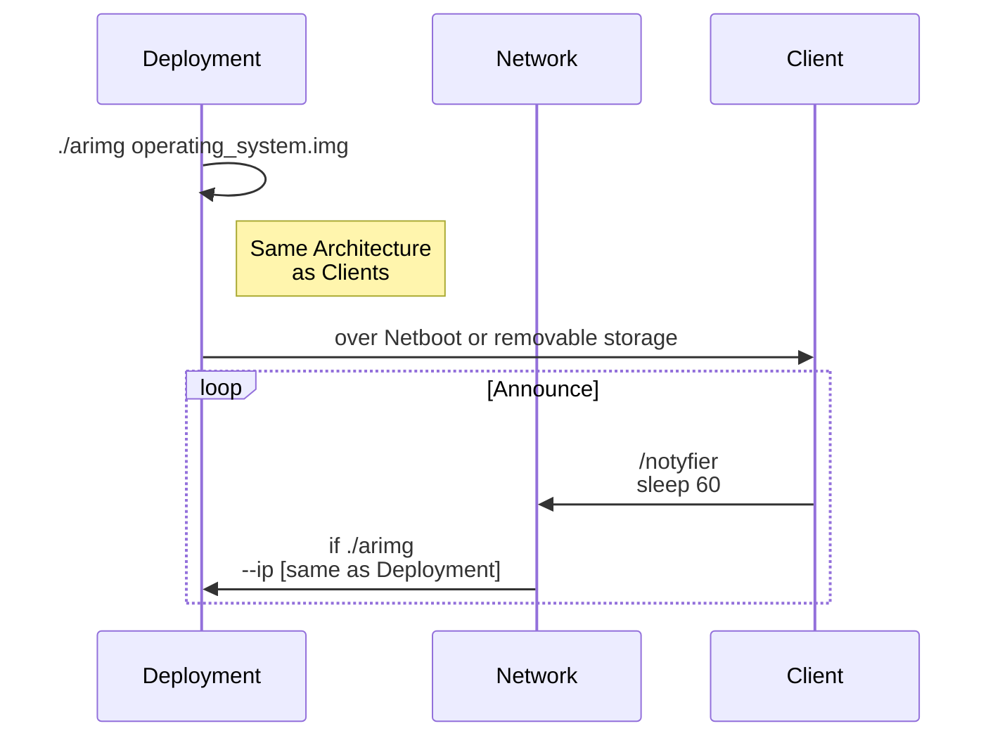

## arimg options

```mermaid
graph TD;
  ./arimg---->|-c|Catch;
  ./arimg----->|-d|Done;

  Catch-->|a|MakeAnsibleInv;
  Catch-->|p|MakePuppetInv;
  Catch-->|c|MakeChefInv;
  Catch-->|n|WipeFile;
  Catch-->|q|Exit;
  option's-->|-i/--ip|AnounceHostIP
  option's-->|-u/--user|AnounceHostUser
  ./arimg--->|option's|input

```

## Deployment chart

```mermaid
sequenceDiagram
    participant Deployment
    participant Network
    participant Client    

    Deployment->>Deployment: ./arimg operating_system.img

    Note right of Deployment: Same Architecture <br/>as Clients

    Deployment->>Client: over Netboot or removable storage
    loop Announce
        Client->>Network: /notyfier <br/>sleep 60
        Network->>Deployment: if ./arimg <br/>--ip [same as Deployment]
    end


```
